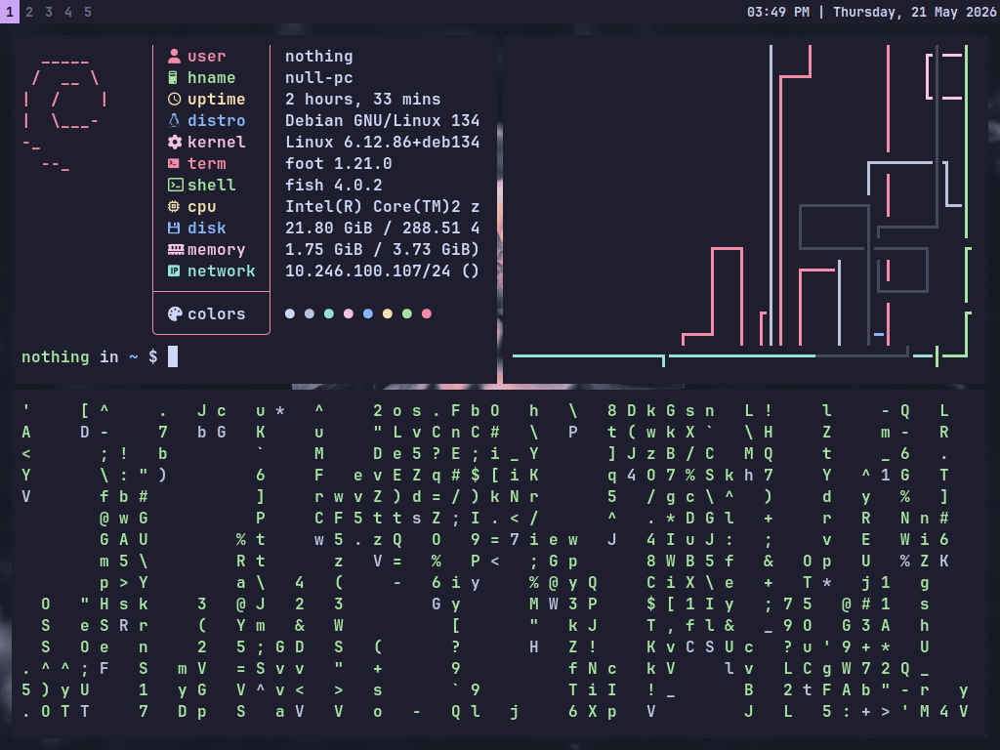
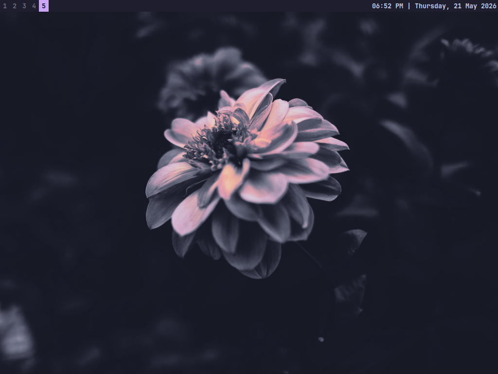
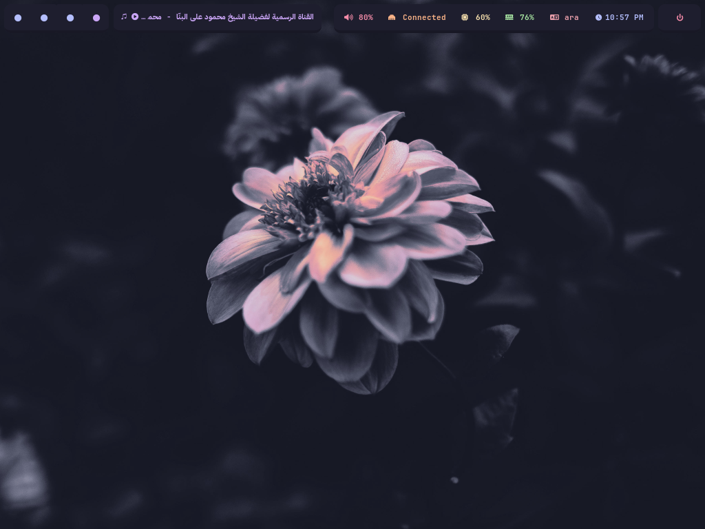
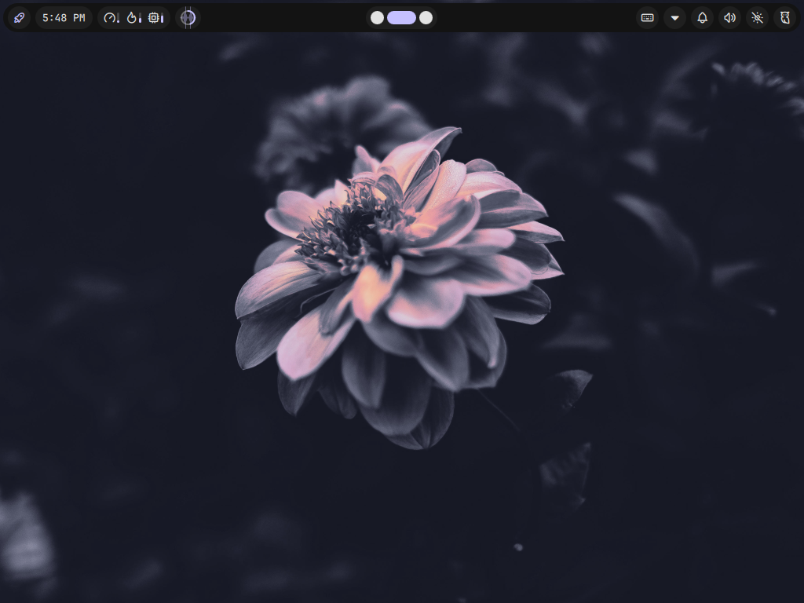

# Sway Dots

My Sway Dots

---

## What does it use?

### Bar:

- SwayBar (First Config)
- Waybar (Second Config)
- Noctalia Bar (Third Config)

**You can switch between the 3 bars through the config file**

### Terminal:

- Foot

### Shell:

- Fish with TMUX

### Launcher:

- Wmenu (First Config)
- Vicinae (Third Config)

**You can also switch between them through the config file**

### Screenshot Utility:

- Grim
- Slurp
- Grimshot

### Font:

- [JetBrainsMono Nerd Font](https://github.com/ryanoasis/nerd-fonts/releases/download/v3.4.0/JetBrainsMono.zip)
- IBM Plex Sans Arabic (For Arabic Text)

---

## What Does it have?

the config files have configs for:

- sway 
- swaybar
- fastfetch
- foot
- fish
- TMUX
- waybar
- noctal
- TMUX
- waybar
- noctalia-shell
- vicinaeia-shell
- vicinae

---

## I want to see it.

### With Swaybar:



### With Waybar:


### With Noctalia:


---

## How can I use it?

Just copy the file to `~/.config/`

```bash
cp -r path/to/repo/* ~/.config/
```
